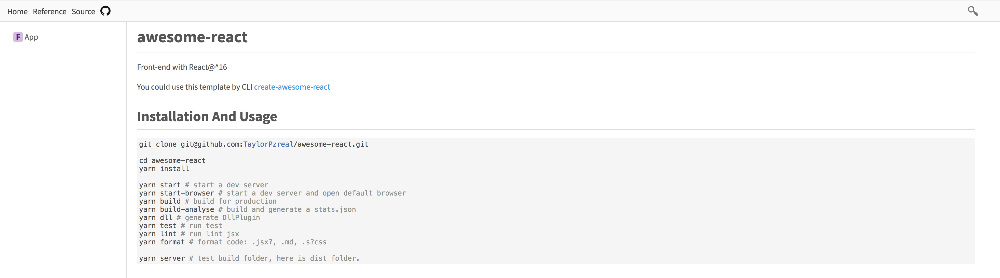

# awesome-react

Front-end with React@^16.8.0

> You could use this template by CLI [create-awesome-react](https://github.com/TaylorPzreal/create-awesome-react)

## Installation And Usage

```bash
git clone git@github.com:TaylorPzreal/awesome-react.git

cd awesome-react
yarn install

yarn start # start a dev server
yarn start-browser # start a dev server and open default browser
yarn build # build for production
yarn build-analyse # build and generate a stats.json
yarn dll # generate DllPlugin
yarn test # run test
yarn lint # run lint jsx
yarn format # format code: .jsx?, .md, .s?css
yarn server # test build folder, here is dist folder.
yarn doc # run esdoc to generate docs.
yarn server-doc # test esdoc generated folder, here is doc folder.
```

## Configuration

- npm init & gitignore
- File structure
- commitlint
- eslint
- format(prettier)
- webpack
- Test
- Router
- Common http request and interceptor
- webpack dll
- precommit format

## Commitlint

> The most common commit conventions follow this pattern:

```md
type: subject(lower-case)

<!-- add one space line -->

body?

<!-- add one space line -->

footer?
```

type includes:

```json
["add", "update", "feat", "fix", "docs", "style", "refactor", "test", "rever"]
```

You could config vim as default editor for git commit, just do:

```bash
git config --global core.editor "vim"
```

## Code styles

- [React/JSX Style Guide](https://github.com/airbnb/javascript/tree/master/react)

## Problems

- [x] Fonts can't load # Make webpack css-loader module: false, [More about css-modules](https://github.com/css-modules/css-modules)
- [x] Jest test conf # Make ReactDom to ReactDOM, word error.
- [ ] redux
- [x] react-router@^4 # [More about dynamic-import](https://github.com/ReactTraining/react-router/blob/master/packages/react-router-dom/docs/guides/code-splitting.md)
- [ ] cssnext

## Support Plans

- [ ] GraphQL
- [ ] Apollo + Relay Modern
- [ ] SSH
- [ ] PWA(Service worker)
- [x] Add ESDoc [Read more](https://esdoc.org/)

  

## More info

- [6 pro tips for React](./docs/best-practice.md)

## MIT License

Copyright (c) 2017 TaylorPzreal
